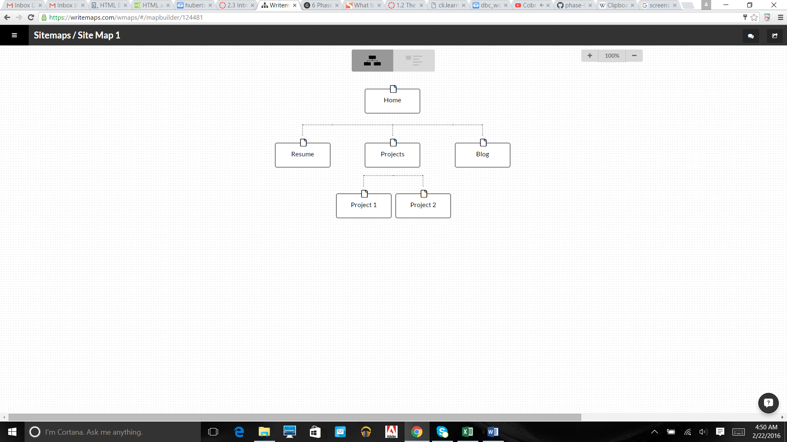

What are the 6 Phases of Web Design?
information gathering
planning
design
development
testing and delivering
maintainance

What is your site's primary goal or purpose? What kind of content will your site feature?
The primary goal of this site is to showcase the projects I did at DBC.

What is your target audience's interests and how do you see your site addressing them?
The primary audience is potential employers. My site will have my resume and list of projects that they can look through.

What is the primary "action" the user should take when coming to your site? Do you want them to search for information, contact you, or see your portfolio? It's ok to have several actions at once, or different actions for different kinds of visitors.
The primary action is to click on the resume link and the project links. The goal is for the user to look through my portfolio and then contact me using my resume.

What are the main things someone should know about design and user experience?
A website's success ultimately depends on how users perceive it.
There does not exist single web design that creates the optimal user experience for every type of website.
There does not exist a quantifiable way of measuring user experience.
User experience is not the same as usability.

What is user experience design and why is it valuable? 
User experience is how someone feels when on the website. The best designs make users happy while navigating your website.

Which parts of the challenge did you find tedious?
Figuring out how to save my site map onto Cloud9.