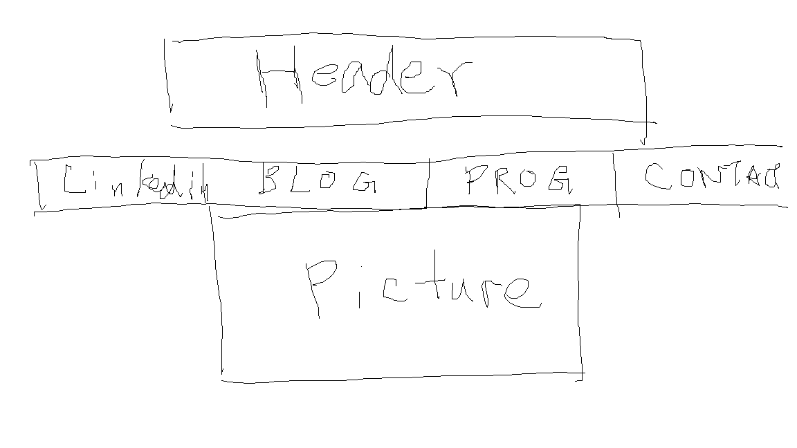

What is a wireframe?
It's a blueprint of what a webpage will look like.

What are the benefits of wireframing?
It lets you organize the informations you want to tell your viewers.

Did you enjoy wireframing your site?
Hard to say for now. There wasn't much to place onto the wireframe. 

Did you revise your wireframe or stick with your first idea?
I stuck with my initial idea.

What questions did you ask during this challenge? What resources did you find to help you answer them?
I needed to see some examples and I just Googled "wireframe examples."

Which parts of the challenge did you enjoy and which parts did you find tedious?
I enjoyed coming up with the design. The drawing part was tedious. I ended up just using Paint and my mouse.